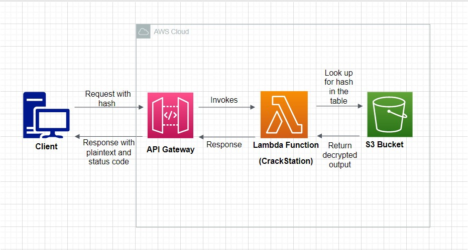

# Decrypter As a Service

Decrypter As a Service is an application which can decrypt strings up to 3 characters and matching the regular expression - [A-Za-z0-9?!]{1,3}. It accepts strings encrypted using SHA-1 or SHA-256.

### *OVERVIEW*
The application accepts strings encrypted by SHA-1 or SHA-256 as input and returns a decrypted string as output. It is implemented as a service with the help of aws. The AWS services used are - API Gateway, Lambda, S3.

### *VERSION*
*1.0.0*

 This version decrypts upto three character strings. The list of characters include alphabets (both uppercase and lowercase), numbers (0-9) and now, "?" and "!". It contains all possible combinations.

*AWS LINK*

[https://kzus28bjfj.execute-api.us-east-1.amazonaws.com/password/{password}](https://kzus28bjfj.execute-api.us-east-1.amazonaws.com/password/{password})

*AUTHOR :*

Venkatesh Subramaniyan
